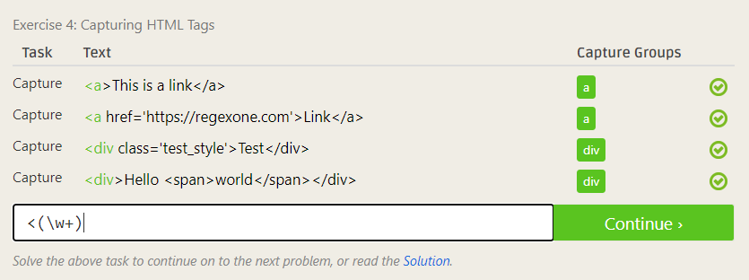

# Lab 01 Report - Introduction to Open Source Software

## 0. Join the Discord if you haven't already

## 1. Create and setup a Github account
1. Name: Thomas Arturi
2. Email: arturt@rpi.edu
3. Discord: Teetle#9198

## 2. Reading assignments - make sure to reflect on these in lab1.md in your repository

### 1. Open Source Definition 

Fascinating definition - the more accessible code is, the more we can improve!

### 2. Smart Questions - How to ask the question The Smart Way.

All these years I've developed my own method for searching questions on the web - this article will come in handy when I'm trying to search for something that I really can't find!

### 3. Do you have more suggestions for How To Answer Questions in a Helpful Way (from your past experience)?

1. If a question genuinely does not belong on a particular site (i.e. StackOverflow), try to be resourceful and redirect the person rather then be aggressive.
2. Don't go to far off topic -- try to stay within the scope of what the person asking the question would be able to understand.

### 4. Please read chapter 3 of Free Culture

I found chapter three of this book very fascinating. Aside from it being a case at RPI that I did not know about prior, I believe the lawsuit and its ending sends a powerful message to those working in software. Taking what is said in the book, I (and likely everyone else who read this) believe that Jesse was innocent and should not have been forced to settle any amount of money. This is because of the nature of open source software. Given that Jesse did not make the base Microsoft search engine, it was not his responsibility to oversee all the user activity on the network. This is not to say, however, that Microsoft should also be liable, but rather the end users who are exploiting the system. For example, the open-source project Tor has been used to traffic drugs over the dark web. However, this is not the main intention of Tor, and the people who should be held liable are those who commit illegal acts over the network.

## 3. Linux

## 4. Regex

### 1. Problems

### 2. Crosswords

## 5. Play with Snap or Blockly
At first I was trying to make it go straight to the end without utilizing the loops/turns. Then I realized that I could allow it to turn on its own.

## 6. Reflection
[Project: QuACS](https://quacs.org/spring2021/#/)
[GitHub Repo](https://github.com/quacs/quacs)

I'm interested in working on the open source project QuACS. After using this tool for a few semesters, I have thought about ways it could be improved. A feature that QuACS could implement is a user account system with the ability to save and view any schedules that you make on the site. Users would also be able to share schedules with each other and add comments to that schedule. Users would find this useful because it would give them the ability to connect with one another through sharing schedules stored in their accounts. For example, you could keep a record of all of the temporary/final schedules you made while at RPI -- to go back and view classes you may have wanted to take prior.

This feature could be implemented with existing technologies in QuACS repository, including Vue.js for frontend and Python for backend.
