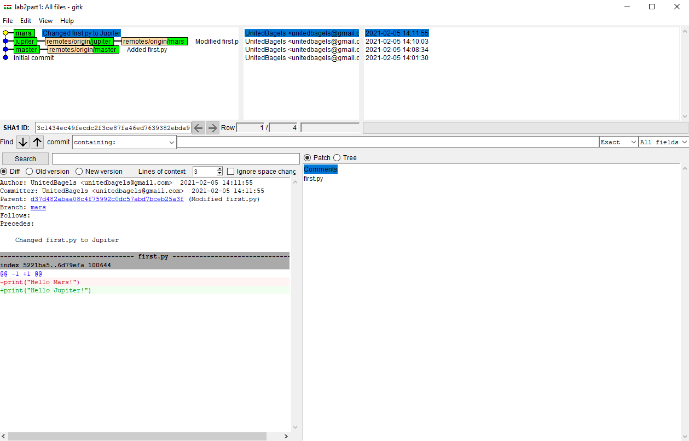
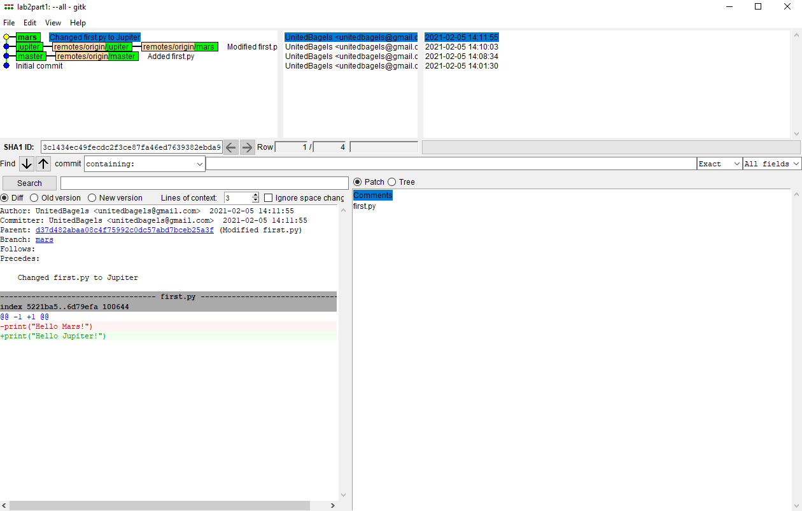
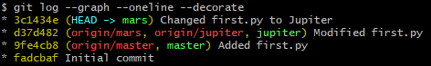
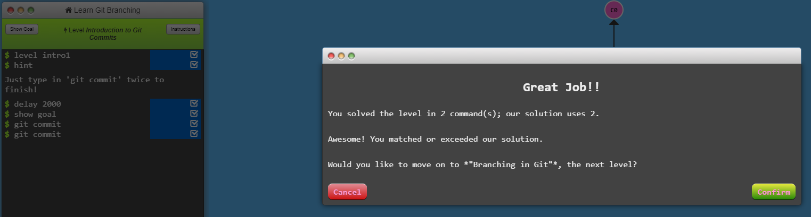
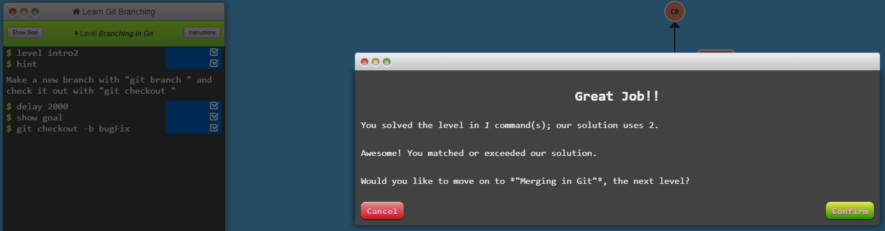
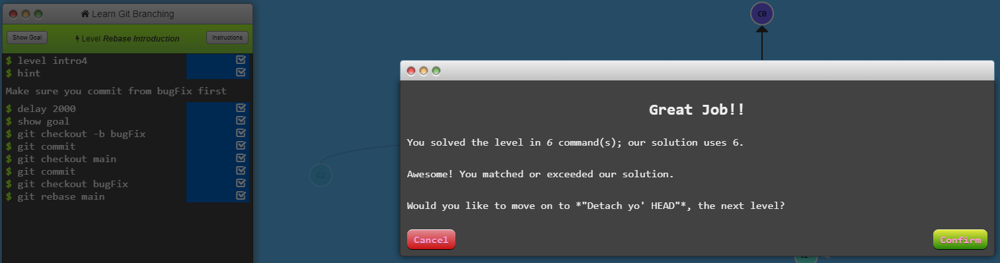
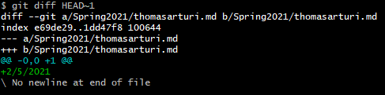
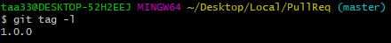

## Part 1
- Lab2Part1 Repo: https://github.com/UnitedBagels/lab2part1

- `gitk`
    
  
- `gitk --all`
    

- `git log --graph --oneline --decorate`
    
  

## Part 2

- Spoon-Knife Repo: https://github.com/UnitedBagels/Spoon-Knife

- Level 1
    
  
- Level 2
    
  
- Level 3
    
  
- Level 4
    
  

## Part 3

- Forked PullReq Repo: https://github.com/UnitedBagels/PullReq

- Git Diff
    
  
- Git Tag
    
  
- OSSProjectIdeas Repo: https://github.com/0NotApplicable0/OSSProjectIdeas

  

    