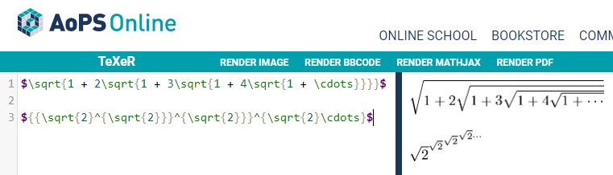
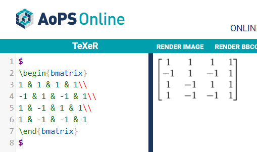

# Thomas Arturi - CSCI 4470 Lab 3

- Link to Wiki: https://github.com/UnitedBagels/oss-repo-template/wiki/Area-of-Interest

### Latex Images

### MarketBot
- Number of branches: 8
- Number of contributors: 4
- Lines of code: 2313
- First commit: Initial commit (fa857b000c2c85ab167a19eb1b02ed26c16a891d)
- Latest Commit: Retrying drop gitignore files (77b7b88c2c12b1d153f1f19893827aafdac2811b) On branch master

### Differences in MarketBot
- Found 2,313 lines of code with git command vs 2,326 lines that gitstats said it found
- Only counted 4 contributors when there is a total of 10 as gitstats found
- Specified commits were constant between gitstats and github

