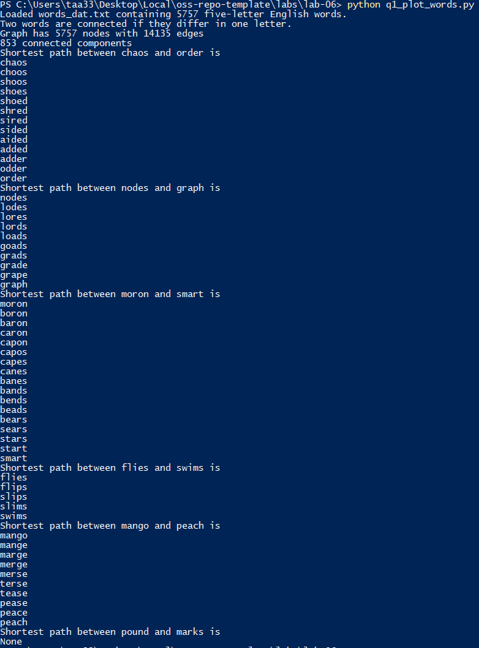
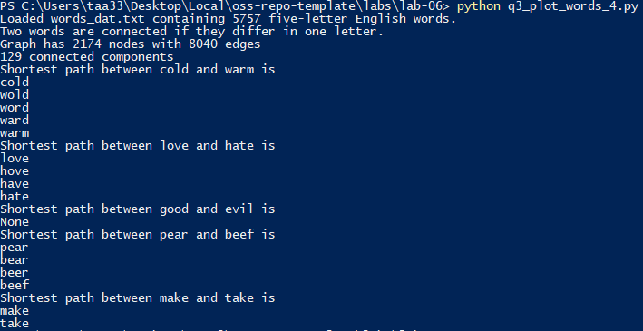
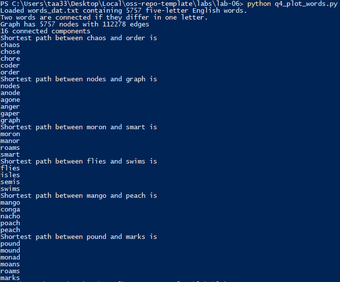

# Lab 6 - CSCI 4470
## Thomas Arturi

### Results for 5 letter pairs



### Code for 4 letter solution (q3_plot_words_4.py)

```python
def generate_graph(words):
    G = nx.Graph(name="words")
    lookup = dict((c, lowercase.index(c)) for c in lowercase)

    def edit_distance_one(word):
        for i in range(len(word)):
            left, c, right = word[0:i], word[i], word[i + 1:]
            j = lookup[c]  # lowercase.index(c)
            for cc in lowercase[j + 1:]:
                yield left + cc + right
    candgen = ((word, cand) for word in sorted(words)
               for cand in edit_distance_one(word) if cand in words)
    G.add_nodes_from(words)
    for word, cand in candgen:
        G.add_edge(word, cand)
    return G


def words_graph():
    """Return the words example graph from the Stanford GraphBase"""
    fh = gzip.open('words4_dat.txt.gz', 'r')
    words = set()
    for line in fh.readlines():
        line = line.decode()
        if line.startswith('*'):
            continue
        w = str(line[0:4])
        words.add(w)
    return generate_graph(words)


if __name__ == '__main__':
    G = words_graph()
    print("Loaded words_dat.txt containing 5757 five-letter English words.")
    print("Two words are connected if they differ in one letter.")
    print("Graph has %d nodes with %d edges"
          % (nx.number_of_nodes(G), nx.number_of_edges(G)))
    print("%d connected components" % nx.number_connected_components(G))

    for (source, target) in [('cold', 'warm'),
                             ('love', 'hate'),
                             ('good', 'evil'),
                             ('pear', 'beef'),
                             ('make', 'take')]:
        print("Shortest path between %s and %s is" % (source, target))
        try:
            sp = nx.shortest_path(G, source, target)
            for n in sp:
                print(n)
        except nx.NetworkXNoPath:
            print("None")
```

### Results for 4 letter pairs



### Code for the unordered solution (q4_plot_words.py)

```python
def generate_graph(words):
    G = nx.Graph(name="words")
    lookup = dict((c, lowercase.index(c)) for c in lowercase)

    def edit_distance_one(word):
        perms = itertools.permutations(word)
        for w in perms:  # This outer for loop makes this pretty inefficient, but we're gonna go with it
            str_word = ''.join(w)  # Convert from char tuple to string
            for i in range(len(str_word)):
                left, c, right = str_word[0:i], str_word[i], str_word[i + 1:]
                j = lookup[c]  # lowercase.index(c)
                for cc in lowercase[j + 1:]:
                    yield left + cc + right

    candgen = ((word, cand) for word in sorted(words)
               for cand in edit_distance_one(word) if cand in words)
    G.add_nodes_from(words)
    for word, cand in candgen:
        G.add_edge(word, cand)
    return G


def words_graph():
    """Return the words example graph from the Stanford GraphBase"""
    fh = gzip.open('words_dat.txt.gz', 'r')
    words = set()
    for line in fh.readlines():
        line = line.decode()
        if line.startswith('*'):
            continue
        w = str(line[0:5])
        words.add(w)
    return generate_graph(words)


if __name__ == '__main__':
    G = words_graph()
    print("Loaded words_dat.txt containing 5757 five-letter English words.")
    print("Two words are connected if they differ in one letter.")
    print("Graph has %d nodes with %d edges"
          % (nx.number_of_nodes(G), nx.number_of_edges(G)))
    print("%d connected components" % nx.number_connected_components(G))

    for (source, target) in [('chaos', 'order'),
                             ('nodes', 'graph'),
                             ('moron', 'smart'),
                             ('flies', 'swims'),
                             ('mango', 'peach'),
                             ('pound', 'marks')]:
        print("Shortest path between %s and %s is" % (source, target))
        try:
            sp = nx.shortest_path(G, source, target)
            for n in sp:
                print(n)
        except nx.NetworkXNoPath:
            print("None")
    #
    # for i in itertools.permutations("chaos"):
    #     print(i)
```

### Results for 5 letter pairs using unordered implementation




