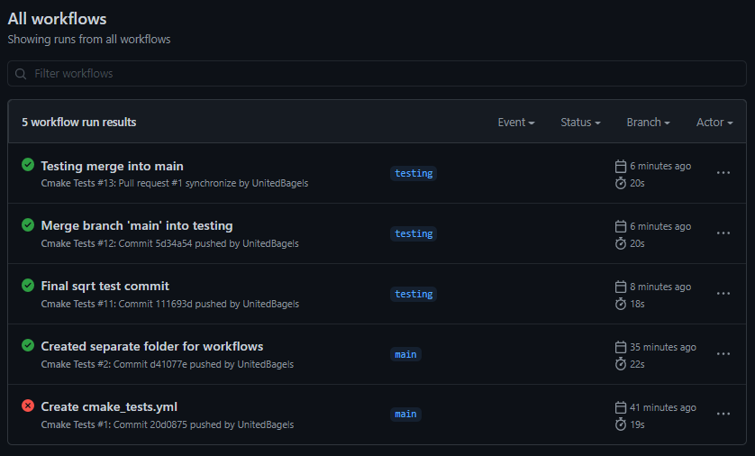

# Lab 8 - CSCI 4470
## Thomas Arturi

### Checkpoint 1

### Checkpoint 2

### Checkpoint 3

#### Faulty Copyright.txt Tests

#### Fixed Copyright.txt Tests

#### Copyright.txt file change/difference

The difference in date (2020 vs 2021) caused the test to fail.

### Checkpoint 4

https://github.com/UnitedBagels/oss_lab8

I had some extra commits trying to get the square root test working - these are not shown in the list of all workflows.

