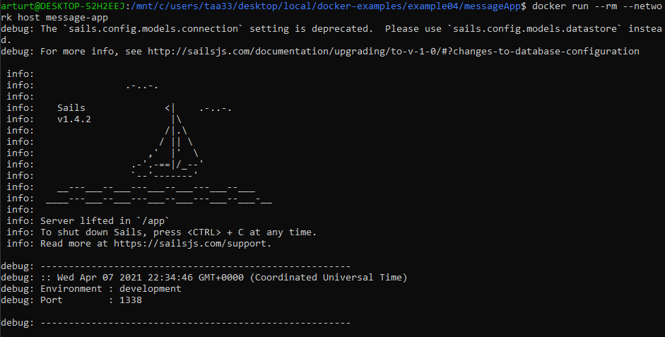

# Lab 9 - Virtualization - CSCI 4470
## Thomas Arturi

### Example 0

Console showing whalesay image:

### Example 1

Setting up Ubuntu:

Creating a file with Vim at root:

Run the cowsay command and substitute user:

### Example 2

Showing currently installed containers:

Rocketchat running on localhost:3000:

### Example 3

Running the Python flask environment in console:

localhost:5000 showing output:

### Example 4

I had an issue running the `npm audit` command, but in office hours I was told to add a .dockerignore file for node_modules which solved the problem.

Getting the messages app running initially:

Adding the first two messages:

Changing the first message:

Deleting the second message:

