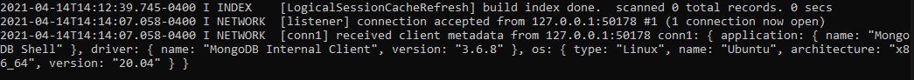
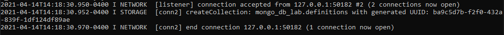
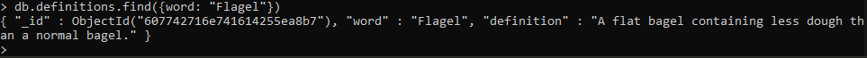
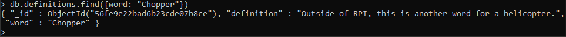
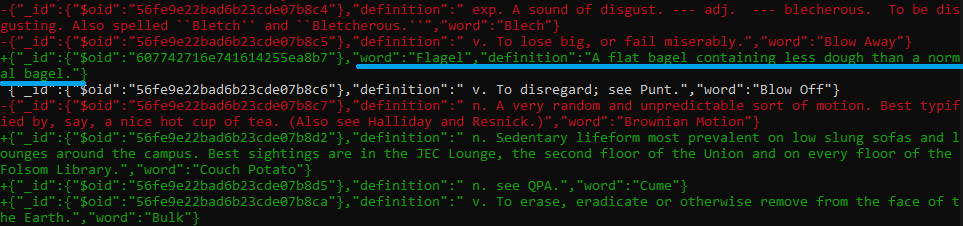
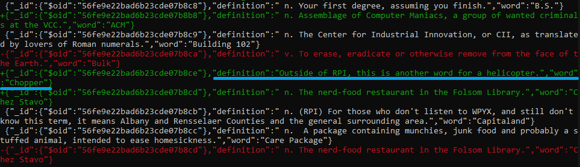

# Lab 9 - Databases - CSCI 4470
### Thomas Arturi

## Checkpoint 0

Here is my blog post for checkpoint 0. It is also available at this link:
https://rcos.io/projects/jakezam/crabapple-conglomerate/blog
>The Supreme Court decision relating to Google and Oracle provides some interesting insight into the future of fair use relating to programming and open source software. Due to the escalation of the case, it is difficult for me to say which side is correct, but based on what I have researched I would side with Oracle. Although only a small portion of the API was used, the amount of impact that it has had is astounding. Android is by far the most widely used mobile operating system, and I believe that Google using a copied section of code in one of their most popular products would be outside the realm of fair use. As for the impact on open source, I believe that this is a step in the right direction, albeit with a faulty motive. It is important for companies that develop APIs to establish a license and explicitly state the terms of that license.


## Checkpoint 1

Connection accepted message from `mongod` window:



## Checkpoint 2

Create collection message:



## Checkpoint 3

Adding and looking up the new word:



Updating and looking up an existing entry:



I had some issues properly displaying the differences in `definitions.json` using `git diff`, since it is showing additional changes in addition to my own. 

I have underlined my changes in the `git diff` windows below. The full file is available at: https://github.com/UnitedBagels/oss-repo-template/blob/master/labs/lab-10/check3/git_diff.txt





## Checkpoint 4

### Code for PyMongo
```python
from pymongo import MongoClient
from bson.objectid import ObjectId
import pprint
client = MongoClient()

if __name__ == '__main__':

    # client = MongoClient('localhost', 27018)
    client = MongoClient('mongodb://localhost:27018/')

    db = client.mongo_db_lab

    definitions = db.definitions

    # Fetch all records
    for doc in definitions.find():
        pprint.pprint(doc)

    # Fetch one record
    pprint.pprint(definitions.find_one())

    # Fetch one specific record
    pprint.pprint(definitions.find_one({"word": "Couch Potato"}))

    # Fetch record by object id
    pprint.pprint(definitions.find_one({"_id": ObjectId("56fe9e22bad6b23cde07b8ce")}))

    # Insert and fetch record
    pprint.pprint(definitions.find_one({"word": "Penguin"}))  # First, make sure it already does not exist
    definitions.insert_one({"word": "Penguin", "definition": "One of the coolest animals on the planet."})
    pprint.pprint(definitions.find_one({"word": "Penguin"}))  # Check to make sure it was added correctly
```

### Output for each section

Fetch all records

Full file is available at: https://github.com/UnitedBagels/oss-repo-template/blob/master/labs/lab-10/check4/fetch_all.txt

```
{'_id': ObjectId('56fe9e22bad6b23cde07b8b7'),
 'definition': " exp. Equivalent to ``gag.''",
 'word': 'Ack'}
{'_id': ObjectId('56fe9e22bad6b23cde07b8c7'),
 'definition': ' n. A very random and unpredictable sort of motion. Best '
               'typified by, say, a nice hot cup of tea. (Also see Halliday '
               'and Resnick.)',
 'word': 'Brownian Motion'}
{'_id': ObjectId('56fe9e22bad6b23cde07b8c8'),
 'definition': ' n. Your first degree, assuming you finish.',
 'word': 'B.S.'}
{'_id': ObjectId('56fe9e22bad6b23cde07b8c9'),
 'definition': ' n. The Center for Industrial Innovation, or CII, as '
               'translated by lovers of Roman numerals.',
 'word': 'Building 102'}
{'_id': ObjectId('56fe9e22bad6b23cde07b8ca'),
 'definition': ' v. To erase, eradicate or otherwise remove from the face of '
               'the Earth.',
 'word': 'Bulk'}
{'_id': ObjectId('56fe9e22bad6b23cde07b8c3'),
 'definition': ' v. To be forced off MTS by the operator, owing to some '
               "``fatal'' computer error.",
 'word': 'Blast'}
{'_id': ObjectId('56fe9e22bad6b23cde07b8cb'),
 'definition': " n. (RPI) For those who don't listen to WPYX, and still don't "
               'know this term, it means Albany and Rensselaer Counties and '
               'the general surrounding area.',
 'word': 'Capitaland'}
{'_id': ObjectId('56fe9e22bad6b23cde07b8cd'),
 'definition': ' n. The nerd-food restaurant in the Folsom Library.',
 'word': 'Chez Stavo'}
{'_id': ObjectId('56fe9e22bad6b23cde07b8cc'),
 'definition': ' n.  A package containing munchies, junk food and probably a '
               'stuffed animal, intended to ease homesickness.',
 'word': 'Care Package'}
{'_id': ObjectId('56fe9e22bad6b23cde07b8ce'),
 'definition': ' n.  (RPI) The ubiquitous supermarket of the Capital District '
               'and all-time favorite food store for RPI students.  Also '
               "called ``Price Gouger'' or ``Price Hacker.''",
 'word': 'Chopper'} ...
```

Fetch one record:

```
{'_id': ObjectId('56fe9e22bad6b23cde07b8b7'),
 'definition': " exp. Equivalent to ``gag.''",
 'word': 'Ack'}
```

Fetch a specific record:

```
{'_id': ObjectId('56fe9e22bad6b23cde07b8d2'),
 'definition': ' n. Sedentary lifeform most prevalent on low slung sofas and '
               'lounges around the campus. Best sightings are in the JEC '
               'Lounge, the second floor of the Union and on every floor of '
               'the Folsom Library.',
 'word': 'Couch Potato'}
```

Fetch a record by object ID:

```
{'_id': ObjectId('56fe9e22bad6b23cde07b8ce'),
 'definition': ' n.  (RPI) The ubiquitous supermarket of the Capital District '
               'and all-time favorite food store for RPI students.  Also '
               "called ``Price Gouger'' or ``Price Hacker.''",
 'word': 'Chopper'}
```

Insert a new record:

```
None
{'_id': ObjectId('60774c56a34bdd75c3aff2a2'),
 'definition': 'One of the coolest animals on the planet.',
 'word': 'Penguin'}
```

## Checkpoint 5

### Code for random selection and date adding:

```python
from pymongo import MongoClient
from bson.objectid import ObjectId
import pprint
import random
import datetime
client = MongoClient()


def random_word_requester():
    '''
    This function should return a random word and its definition and also
    log in the MongoDB database the timestamp that it was accessed.
    '''

    doc_num = random.randrange(definitions.estimated_document_count())

    count = 0
    for doc in definitions.find():
        if count == doc_num:
            date = datetime.datetime.utcnow().isoformat()
            obj = ObjectId(str(doc["_id"]))
            try:
                date_list = doc['dates']
                date_list.append(date)
                definitions.update_one({'_id': obj}, {'$set': {'dates': date_list}})

            except KeyError:
                definitions.update_one({'_id': obj}, {'$set': {'dates': [date]}})

            return definitions.find_one({'_id': obj})

        count += 1

    return


if __name__ == '__main__':

    client = MongoClient('mongodb://localhost:27018/')

    db = client.mongo_db_lab

    definitions = db.definitions

    print(random_word_requester())
```

### Result of finding the first element with two dates:

```
{'_id': ObjectId('56fe9e22bad6b23cde07b8d8'), 'definition': ' v. To destroy, delete or eliminate.', 'word': 'De-rez', 'dates': ['2021-04-14T20:42:08.404566', '2021-04-14T20:44:40.995928']}
```
