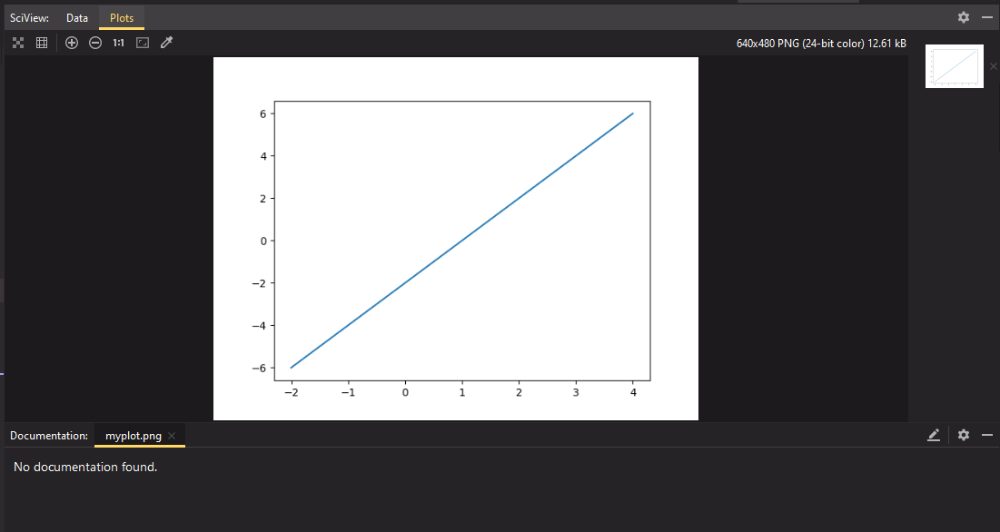
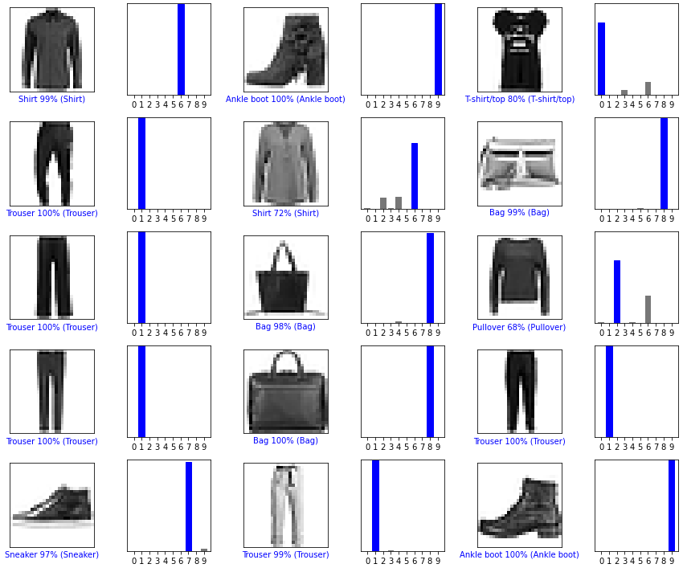
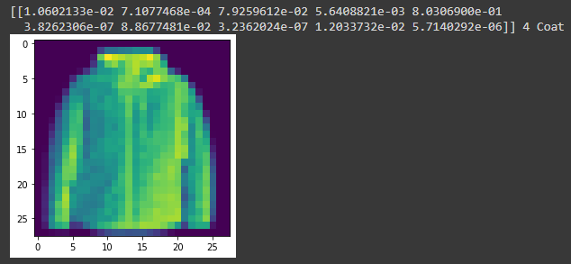
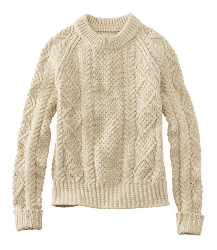
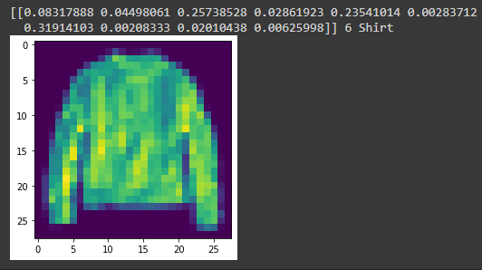
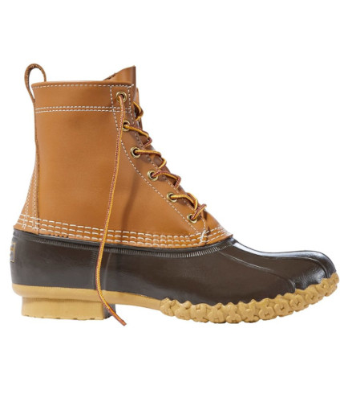
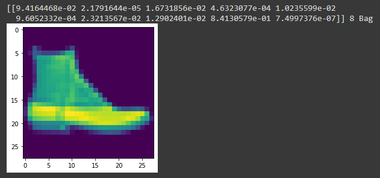

# Lab 9 - Databases - CSCI 4470
### Thomas Arturi

## Checkpoint 1

Pop-up showing TensorFlow working:

## Checkpoint 2

Showing images 9000 - 9014 instead of images 0 - 15:

## Checkpoint 3

### Image 1: Coat

Result: Correct match!

### Image 2: Sweater (Shirt)

Result: Despite there being no label for Sweater, the model correctly identified this as a shirt, which is what I was hoping.

### Image 3: Boot

Result: This was the only one the model did not correctly identify. The expectation would be for the label 'Ankle boot' or even 'Sneaker', but not terrible results overall.   

