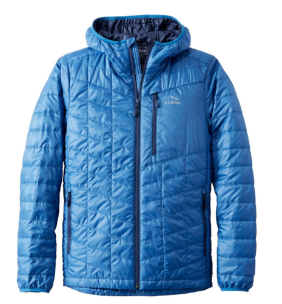

# Lab 10 - TensorFlow - CSCI 4470
### Thomas Arturi

## Checkpoint 1

Pop-up showing TensorFlow working:


## Checkpoint 2

Code for showing the images:

```python
num_rows = 5
num_cols = 3
num_images = num_rows*num_cols
plt.figure(figsize=(2*2*num_cols, 2*num_rows))
for i in range(num_images):
  j = i + 9000  # add 9000 to the index
  plt.subplot(num_rows, 2*num_cols, 2*i+1)
  plot_image(j, predictions[j], test_labels, test_images)
  plt.subplot(num_rows, 2*num_cols, 2*i+2)
  plot_value_array(j, predictions[j], test_labels)
plt.tight_layout()
plt.show()
```

Showing images 9000 - 9014 instead of images 0 - 15:


## Checkpoint 3

### Image 1: Coat



Result: Correct match!


### Image 2: Sweater (Shirt)


Result: Despite there being no label for Sweater, the model correctly identified this as a shirt, which is what I was hoping.


### Image 3: Boot


Result: This was the only one the model did not correctly identify. The expectation would be for the label 'Ankle boot' or even 'Sneaker', but not terrible results overall.   


